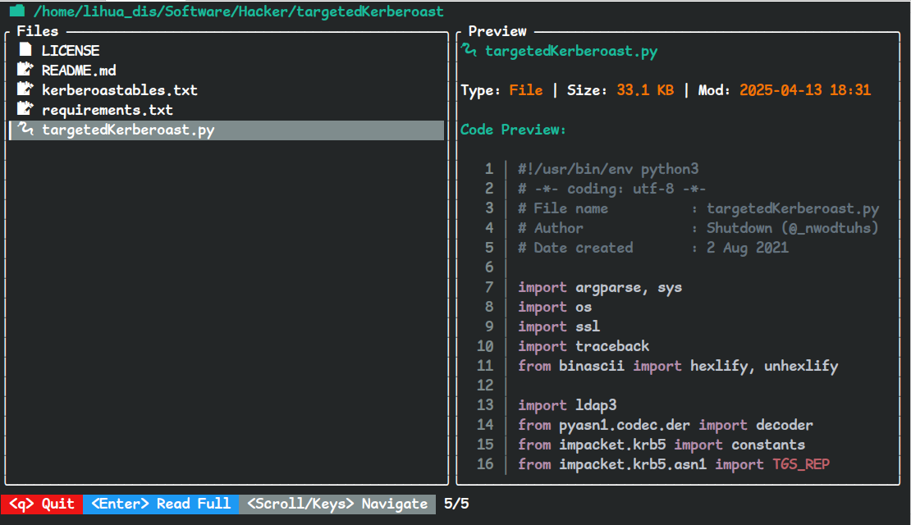

# lsz

> **极简、高效的命令行文件助手**  
> *A modern CLI file manager with persistent notes and interactive TUI previews.*

[](https://www.rust-lang.org/)
[](LICENSE)

**lsz** 是一个基于 Rust 编写的现代化 `ls` 替代工具。它不仅能列出文件，还能让你给文件/目录**添加持久化注释**，并提供了一个基于 TUI 的**分栏预览**界面，支持 Markdown 渲染和代码语法高亮。




## ✨ 核心特性 (Features)

- 📝 **持久化注释**：不再忘记这个目录是干嘛的，直接 `-s` 添加备注（基于 SQLite，永久保存）。
- 🖥️ **交互式 TUI**：`-l` 进入双栏模式，左侧导航，右侧实时预览。
- 🎨 **语法高亮**：预览 Rust, Python, JSON 等代码时自动着色，并显示行号。
- 📖 **Markdown 渲染**：在终端内直接渲染精美的 README 文档（支持标题、粗体、列表等）。
- 📂 **图标支持**：集成 Nerd Fonts，文件类型一目了然。
- ⚡ **极速体验**：Rust 原生编写，毫秒级启动。

## 🚀 安装 (Installation)

### 前置要求
请确保你的终端安装了 **[Nerd Fonts](https://www.nerdfonts.com/)** 字体（如 `JetBrainsMono Nerd Font`），否则图标会显示为乱码。

### 从源码安装
```bash
git clone https://github.com/803S/lsz.git
cd lsz
cargo install --path .


# (可选)如想编译后手动指定路径则如下
## 编译后在target/release找到编译后的文件复制到/usr/local/bin/也可
cargo build --release
```


## 📖 使用指南 (Usage)

### 1. 基础列表

像 `ls` 一样使用，如果有注释，会自动显示在右侧。

```bash
lsz           # 列出当前目录
lsz src/      # 列出指定目录
```

### 2. 添加/删除注释

给难以记忆的文件或目录添加备注，数据存储在 `~/.lsz.db`。

```bash
lsz -s "这是项目的核心逻辑" ./src/main.rs  # 添加注释
lsz -d ./src/main.rs                     # 删除注释
lsz -gc                                  # 清理无效记录 (GC)
```

### 3. 交互模式 (TUI)

```bash
lsz -l        # 进入交互模式
```

| 按键                 | 功能                                        |
| -------------------- | ------------------------------------------- |
| `↑` / `k` / `Scroll` | 向上移动                                    |
| `↓` / `j` / `Scroll` | 向下移动                                    |
| `Enter`              | **全屏阅读** (支持 Markdown渲染 / 代码高亮) |
| `n`                  | 切换行号显示 (仅全屏代码模式)               |
| `q` / `Esc`          | 退出                                        |

**提示**：在 TUI 模式下，按住 `Shift` 键可使用鼠标划选复制文本。

### 4. 项目卡片模式

快速查看项目的 README 和人工备注。

```bash
lsz -i ./my-project
```

## 🛠️ 技术栈

- **[Ratatui](https://github.com/ratatui-org/ratatui)**: 强大的终端 UI 引擎
- **[Termimad](https://github.com/Canop/termimad)**: Markdown 渲染
- **[Syntect](https://github.com/trishume/syntect)**: 代码语法高亮
- **[Rusqlite](https://github.com/rusqlite/rusqlite)**: SQLite 数据库交互

## 📄 License

MIT License
